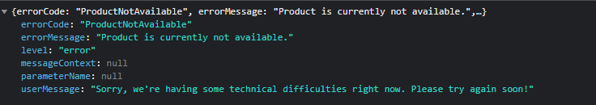

# WebdriverIO tests

## About
WebdriverIO tests. Run with either docker for fast and simple, or install and configure the Repo.
A lot of things can also be automated with CI/CD, but I took the liberty not to x(. Also obviously
you don't push .env file to the Repo, but this is for simplicity.

I ran into some problems writing the tests specifically for asos.com. It seems they think I am a bot, because
they are preventing me from adding items to the basket. I added it as a test case. The error they return

## With Docker
### TL;DR Just let me run it
1. Run either ``start_n_rebuild_docker.bat`` or ``start_n_rebuild_docker.sh`` based on your OS. This will run
Selenium-hub container, A Chrome Node container and Build your WebdriverIO image.
2. Then run WebdriverIO container and save results
<pre>docker run -v "$(pwd)/allure-results:/app/webdriver-test/allure-results" --net selenium-grid -it webdriverio</pre>

### Run with docker detailed
1. Create a network for containers
<pre>docker network create selenium-grid</pre>
2. Start Selenium Hub in the network and map ports
<pre>docker run -d -p 4442-4444:4442-4444 --net selenium-grid --name selenium-hub selenium/hub:latest</pre>
3. Start a browser node in the same net. For example, Chrome
<pre>docker run -d --net selenium-grid -e SE_EVENT_BUS_HOST=selenium-hub --shm-size="2g" -e SE_EVENT_BUS_PUBLISH_PORT=4442 -e SE_EVENT_BUS_SUBSCRIBE_PORT=4443 selenium/node-chrome:latest</pre>
4. Build a Docker image for WebdriverIO. 
<pre>docker build . -t webdriverio --no-cache</pre>
5. Run the tests. Copy the allure-results folder from the container to your local machine 
``-v :``
<pre>docker run -v "$(pwd)/allure-results:/app/webdriver-test/allure-results" --net selenium-grid -it webdriverio</pre>

## Without Docker
### Installation guide
1. Clone the repo
2. Install WebdriverIO globally for ease of use
<pre>npm install -g webdriverio</pre>
3. In the project root run ``npm install``
4. Find the version of your current chromedriver. WebdriverIO installs it automatically 
``npm show chromedriver version``
5. From https://chromium.cypress.io/ install the browser that fits your version. Move the ``chrome-`` folder
inside the project root.
6. Change the config file (``wdio.conf.ts``) so the binary path of Chrome is pointing to the binary of the portable browser.
<pre>
capabilities: [{
    maxInstances: 5,
    browserName: 'chrome',
    'goog:chromeOptions': {
        binary: './chrome-win/chrome.exe',  // This line
        args: ['--disable-gpu', '--no-sandbox', '--disable-dev-shm-usage', '--window-size=1920,1080'],
    }
}],
</pre>
7. Run the tests ``npx wdio wdio.conf.ts``

## Allure reports (optional)
### Installation
1. Get Java 8 or higher
2. Install allure globally ``npm install -g allure-commandline --save-dev``
3. Generate the report ``npm run generateReport``
